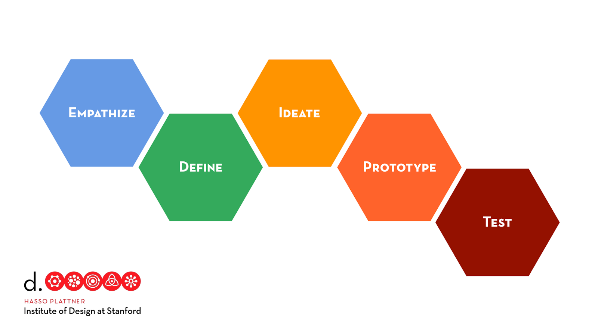
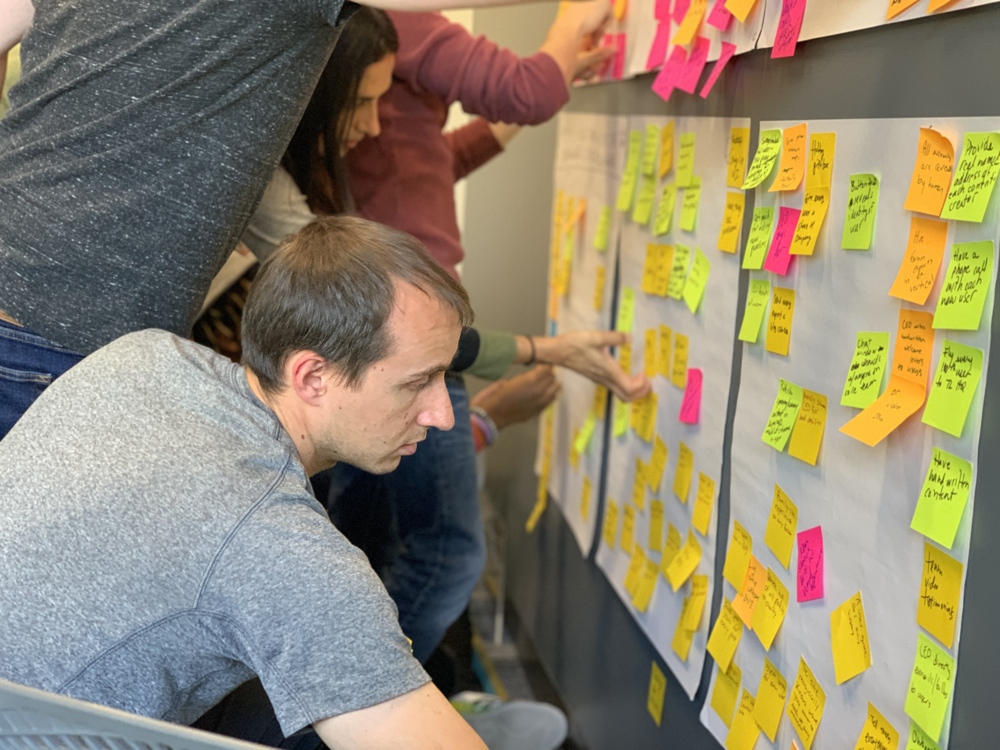
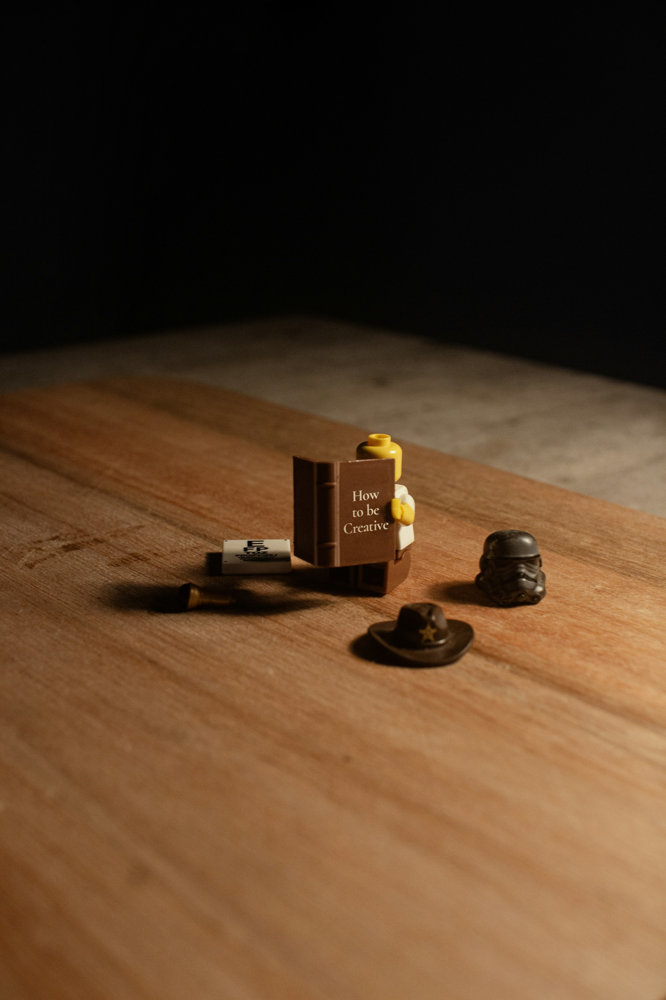

Being skeptical of any process that promises to speed up product development is understandable. My
experiences at startups and big companies alike have involved 24-hour or several-day hackathons that
resulted in intriguing ideas and presentations to executives that ultimately went nowhere. While
these innovation efforts were well-intentioned, their structure did not allow the resulting ideas to
come to fruition. They served to energize the team and to create excitement but didn't move the
company forward in any meaningful way, making them arguably pointless. When rallying cries of
bottom-up innovation end up only in pretty post-its on a whiteboard, many product and engineering
leaders are left justifiably jaded and begin to favor founder- and exec-led product development
instead.
  
<a href="https://designthinking.ideo.com">Design thinking</a> has been criticized in much the same
way - a hyped-up process that leads nowhere, despite <a href="https://medium.com/r/?url=https%3A%2F%2Fhbr.org%2F2018%2F09%2Fwhy-design-thinking-works">success
stories</a> and case studies from Bank of America (<a
href="https://medium.com/r/?url=https%3A%2F%2Fwww.bloomberg.com%2Fnews%2Farticles%2F2006-06-18%2Fcase-study-bank-of-america%3Fembedded-checkout%3Dtrue">Keep
the Change</a>, a currently <a href="https://www.bankofamerica.com/deposits/keep-the-change/">live
product</a>), GE Healthcare (<a href="https://medium.com/r/?url=https%3A%2F%2Fwww.youtube.com%2Fwatch%3Fv%3DjajduxPD6H4">MRI</a>),
Embrace Global (<a href="https://medium.com/r/?url=https%3A%2F%2Fwww.gsb.stanford.edu%2Ffaculty-research%2Fpublications%2Fembrace-deciding-hybrid-structure">infant
warmer</a>), <a href="https://medium.com/r/?url=https%3A%2F%2Freview.firstround.com%2Fhow-design-thinking-transformed-airbnb-from-failing-startup-to-billion-dollar-business%2F">Airbnb</a>, IDEO, and more. I know these
stories well because I was trained in design thinking at Stanford's <a href="https://medium.com/r/?url=https%3A%2F%2Fdschool.stanford.edu%2F">d.school</a>. I practiced it working
on projects to redesign wheelchairs for underserved populations and prototype product ideas for
well-known partner companies such as Fidelity, Jetblue, etc. I've experienced the benefits that this
process offers, helping teams achieve the holy grail of product-market fit. However, once I left
school and began working, product development was top-down. Design thinking was foreign to the teams
I worked on. My teammates struggled with the ambiguity of new product development and not knowing
whether they were building a product that people would love. This was familiar to me because I had
struggled similarly before. I knew that design thinking could help relieve anxiety and help us to
figure out the right direction more quickly. However, introducing design thinking was an uphill
effort because these startup teams were skeptical. After experimenting with different approaches to
introducing this methodology into my teams' product development, I was able to successfully apply
design thinking to launch MVPs and, in the process, helped my colleagues to experience its benefits
first-hand.
  
I was trained in design thinking at Stanford's d.school. Practice came from redesigning wheelchairs
for underserved populations in Entrepreneurial Design for Extreme Affordability, prototyping product
ideas for partner companies in Innovation in Complex Organizations like Fidelity, Jetblue, and many
more. The process was unquestioned and celebrated in a school founded by the founder of IDEO.
However, in industry, most companies practice the founder-led product development process.
Introducing design thinking was an uphill effort—if it was even considered.
  

  

<b>How might design thinking help my team?</b>
  

Design thinking consists of the following phases: empathize, define, ideate, prototype, and test.
These phases are iterative and teams can revisit any of them as needed.
  
Practicing design thinking to launch an MVP had the following impact on teams that I've worked with:
  
<ol>
  <li>
    Team buy-in
    

      Typically, only product leaders (PMs, founders, execs) or designers talk to users and
      communicate their findings to the team. However, a lot of nuance about users is lost if the
      conclusions are reported out as prescribed solutions or lengthy reports that don't connect
      user insights to recommended actions. All team members must gain a deep understanding of users
      to develop empathy for them - hard to do when relying on someone else's interpretation. When
      team members from different functions (engineering, product, design, etc.) collaborate in the
      empathy phase, they create a shared understanding of the user's world and pain points. This
      helps the team to understand potential user problems and to frame hypotheses about what
      product direction could address those problems. The team won't need to be convinced of the
      strategy because they will have helped to shape it. Lengthy debates with no resolution are
      less likely to happen. The design thinking process has defined phases of exploration that
      force forward momentum and help keep teams from being bogged down in endless debate. As a
      result, decision-making is faster, and the team is aligned rather than resigned and
      indifferent. 100% agreement isn't needed to move forward, just their commitment to testing at
      each phase and learning from users.
    

  </li>
  <li>
    Fast learnings 
    

      it might be blasphemy to suggest that work can be fun, but it's true that when team members
      trust one another and apply their expertise to create products that users love, they have fun.
      In the design thinking process, engineers who are passionate about the product, and not just
      the underlying technology, are involved from the beginning and can see the impact of their
      work via direct contact with users. That emotional connection inspires and creates a
      fulfilling experience for all team members. Being able to experiment, make mistakes, and learn
      quickly makes work feel like play. Fun encourages intrinsic motivation.
    

  </li>
  <li>
    Managed anxiety 
    

      New product development is intense and anxiety-inducing because there is no single solution.
      Given that there are no right answers, it isn't clear if the team is working on a solution
      that has product-market fit - user feedback can be conflicting and lukewarm. For engineers
      learning and practicing design thinking, the uncertainty of new product development is
      challenging when they are involved from the beginning - it was for me. It may be even harder
      when non-engineering teammates suggest wildly unfeasible ideas. However, knowing that ideation
      is a phase and expecting it to be broad for a limited time can help to relieve anxiety. Teams
      eventually progress beyond brainstorming (as my teams did), even though it may temporarily
      feel like a dumpster fire at various points. The design thinking structure helps to manage the
      emotional maelstrom that team members who are not accustomed to operating without constant
      clear direction might feel.
    

  </li>
  <li>
    Fun 
    

      It might be blasphemy to suggest that work can be fun, but it's true when team members trust
      one another and utilize their expertise to create products that users love. In the design
      thinking process, engineers who are passionate about the product, and not just the tech, are
      involved from the beginning and can see the impact of their work via user feedback. That
      emotional connection inspires and creates a fulfilling experience for all team members. Being
      able to experiment, make mistakes, and learn quickly makes work feel like play. Fun encourages
      intrinsic motivation.
    

  </li>  
</ol>
  

<b>How can my team adopt design thinking?</b>
  
I knew that only by adopting and practicing design thinking, would my teams realize its benefits. In
one instance, I chose a pragmatic approach of only applying portions of design thinking to the
current product development process. This introduced the team to the different concepts of each
phase and allowed them to practice without necessarily being aware that they were using design
thinking. I chose this approach because I realized that dogmatically evangelizing it would cause
undue pushback, as so often happens when people feel pressured into a prescribed course of action.
  

<b>Piecemeal application</b>
  
The team's process was founder-led, and new product ideas were launched once or twice a year. For a
few months, they had tried variations of a product experience that the founders had already
conceived of and had conviction in. They wanted a designer who could realize that vision and design
the experience. The team was already in building mode. It would have been a hard sell convincing
them that we needed to restart - I did not have enough historical knowledge to know if it was
warranted. Although I trained the team in design thinking via a full-day workshop, some team members
were still uncertain about how to apply it. Having trained past teams, I realized that adoption was
contingent on practice but didn't have to be all or nothing. Instead, I listened to the team's
feedback. I identified when to involve them, depending on their interest in the phases: empathize,
define, ideate, prototype, or test.
  

  

Even though we weren't practicing the design thinking process in its entirety, I selected crucial
elements and incorporated them. The development train was in full swing, so I had to continue
designing the UX while filling the gaps in my knowledge. During user feedback sessions for the
mockups of different experience options, I used the opportunity to perform additional user research.
The ad hoc and piecemeal nature of this research was challenging. Without restarting at the very
early empathy phase, I tried to create a shared understanding of users and pain points. I relayed
the learnings to the team and ensured all their questions were answered. I sought to inform them via
succinct Slack write-ups, meetings, and individual 1:1s. I shared information in different formats:
high-level summaries, synthesis of insights, raw notes, and interviews. This allowed team members to
learn how I drew certain conclusions and double-check my understanding. The varying levels of detail
gave them the freedom to form their own opinions without relying on my potentially erroneous
conclusions. Engineers are not as involved with user feedback as often as designers and PMs, so I
kept them as informed as they wanted without being overwhelmed. This level of transparency and
access strengthened the team's trust in my work.
  

When we wanted to test more ideas, I facilitated brainstorming sessions using the design thinking
ideation rules to generate as many ideas as possible before narrowing down to a few to mock and
test - a change from just translating the sketches made by founders. Concept testing different ideas
with wireframes instead of building out only one idea helped us to eliminate time debating which
idea had the most merit. We didn't need certainty to move forward, even when user feedback didn't
provide full clarity. We were able to test and iterate on different solutions frequently.
  

While this process greatly improved how quickly the team was iterating, it had the fatal flaw that
the team had never iterated on the problem definition, but instead were already building what the
founders had envisioned when I joined. It wouldn't have been an issue if we had been right about the
problem and its solution. We weren't.
  

Although it wasn't ideal, practicing the different design thinking phases piecemeal helped the team
to become familiar with what was involved in each phase and how we would operate. It shifted product
development from an assembly line with specific functions performing different tasks to one that was
more collaborative from the beginning. Team members also developed confidence in their creativity
contributing where they hadn't been involved before. When we ultimately ended up pivoting product
direction, it was a smoother transition to practicing the design thinking process in its entirety.
  

  

<b>Practicing the entire process</b>
  

We pivoted several times quickly in less than 12-week increments because now design thinking allowed
us to experiment, course-correct, and abandon ideas that garnered only lukewarm user feedback. Team
members were involved as much as they wanted to be, but everyone shared the same knowledge and moved
through the phases together. To kick off the process, I performed user research to explore the space
in 1–2 weeks. The founders and I would then work together to define the problem and create "How
might we" questions that formed the basis for the hypotheses to test. This was new to the team but
was crucial to helping us explore a more open-ended solution space than we had before. We followed
up by brainstorming, prototyping, and testing the design thinking way, which the team was now
familiar with. Given the team's full participation from the beginning of the process, we were able
to move more quickly, even iterating on the problem space itself, not just the solutions. In the
final pivot for the MVP, user feedback indicated we were onto something promising. It wasn't clear
yet that there was a product-market fit, but we had signals that it was the right direction. We
achieved this in 8 weeks after 2 pivots versus the year that we had spent on a single idea before
pivoting.
  

Ultimately, product-market fit isn't guaranteed - no process can promise that. Other processes can
help us get there too. Design thinking focuses on the experience of team members, to make that
destination more probable. The journey became enjoyable as we worked together better, learned
faster, and honed in on the options for product-market fit. We were now a team, not just colleagues.
Being united helped us to focus on getting to an MVP much faster despite the uncertainty and
ambiguity of new product development.
  
