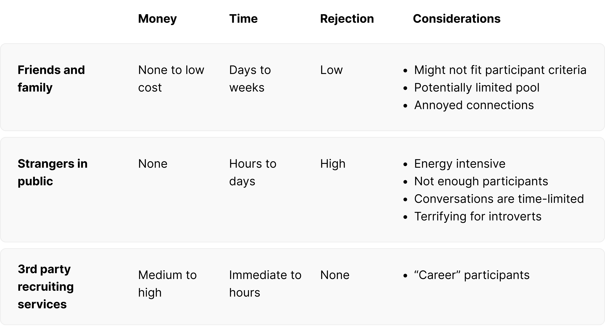
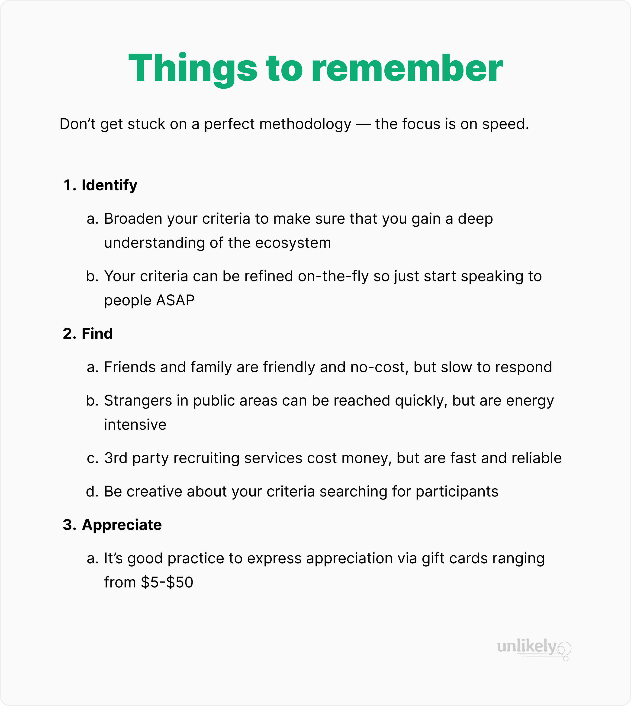

Arguably, the most crucial part of product development is the discovery stage — when the team,
founders in the early stages of a startup, or designers and PMs in later stages conduct user
research. This is called many things: contextual inquiry, needfinding, user research, etc. User
research can carry emotional baggage and the preconceived notion that it can only be performed by
professional researchers or product/UX designers trained in research. Startup teams mistakenly
believe that designers are also researchers and that they do not need to hire specifically for that
purpose. However, designers who can perform user research are typically senior (hard to attract) and
may not be as comfortable doing so as a user researcher would. Having trained researchers and
designers equipped for the task is also a luxury that most startups do not have, so they will have
to figure out how to do their own user research. This is especially true in the early stages of a
startup — before a meaningful round of funding that would allow them to hire or contract out.
Another misconception is that user research takes months (way too long in the life of a startup) and
that the resulting written reports do not lead to any meaningful impact on product development. This
might happen in larger corporate teams where user research is a separate functional organization,
where findings are handed off to product teams that do not know what to do with the information. But
it does not have to be that way.

 

User research can take many forms, be completed in a matter of days, and be tightly integrated into
the product development process. Most teams know that they should talk to users early and often, and
many try to follow helpful UX research resources from <a
href="https://review.firstround.com/a-ux-research-crash-course-for-founders-customer-discovery-tips-from-zoom-zapier-and-dropbox/">First
Round</a>, <a href="https://library.gv.com/gv-guide-to-uxresearch-for-startups-b6d0c8ac81b3">Google Ventures</a>, etc. However, my
experience has been that startups do not do this early enough and definitely not as often as needed.
In favor of speed, user research gets dropped and startups experience <a
href="https://hbr.org/2021/05/why-start-ups-fail">“false starts”</a> or it becomes a
one-time effort. To avoid this, I have practiced scrappy user research to make talking to users a
continuous effort. This involves doing things that may not be considered “the right way” and could
be criticized by established research teams in large companies. Even so, it is more important to
talk to many users as often as possible than to be paralyzed by the fear of not doing it right and
building something no one wants.

 

By adopting a scrappy user research approach, startup teams without the expertise can learn how to share the responsibility.
Typically, the team knows they want to solve a problem in a particular space and what the solution
might be. While they may be confident they know what those are, it is necessary to verify them.
Stories about highly respected, well-funded startups that eventually die indicate that some
combination of the 3 was not what they believed. We can do our quick due diligence to gain
confidence that we are on the right path to avoid that fate. Many of my experiences are in consumer
spaces, but some lessons are just as valuable in other spaces.

<h4 class="ts-fs-4 fw-800 mt-24 mb-16">Step 1: Identify the people to interview</h4>

The first operational challenge to kicking off the user research process for me has been recruiting
participants to interview. This has always been difficult because startups do not have the large
budgets to outsource the task to a 3rd party (or at least, they are reluctant to). Since we are
talking about doing this the scrappy way, assume that we have a few hundred dollars to allocate for
user research.

 

The time to identify participants to recruit is when you know the space you need to understand
better, broad or specific. When I wanted to figure out how to help people achieve their dreams, I
knew I needed to understand their relationship to dreams. My criteria for identifying participants
was loose — anyone with a dream. Although this may seem too broad to be effective, I was not
concerned because I sought participants who differed in gender, age, profession, etc. This approach
gave me peace of mind that I was not focused too narrowly on any single group (demographics or
behavioral) and would not miss out on insights that might be associated with specific segments. Once
I could identify patterns in behavior, I could focus on recruiting more participants who fit the
refined criteria. Casting a wide enough net allowed me to ascertain if there were differences. In
startup life, begin as soon as possible because the end of the runway looms. Speed is more important
than getting hung up on the perfect participant profile. Even if your project already has
well-defined criteria for participants, you should still broaden it in the early stages of
research.

 

It may feel like a waste of time (some of it could be), but the deep understanding you will gain of
the space using this approach will also be helpful in the future. You may have confidence that this
is your target user segment, and they might be for a while. If that changes, doing broad research
will allow you to pivot to another segment without starting over. Having knowledge of other
potential segments will inform your decision on whether to pivot and to which segment — you will not
have to restart the research from the beginning.

<h4 class="ts-fs-4 fw-800 mt-24 mb-16">Step 2: Find participants for user research</h4>

It used to be difficult to recruit participants for user research as a startup because we did not
have the budget to outsource that work to a 3rd party. The lack of money also made it difficult to
compensate them, as is industry practice. Given that this is the norm for startups, being scrappy
and trying different methods helps.
  

<h5 class="ts-fs-5 fw-800 mt-24 mb-16">Option 1: Friends and family are no-cost participants, but there are drawbacks</h5>

Recruiting friends and family to be interviewees for exploratory research or to give feedback on
prototypes has always been tremendously helpful. Shamelessly reaching out to them for help and
describing what you need from them (i.e. 30 minutes to ask questions about their shopping habits)
can be very effective. Of course, getting everyone on the team to reach out to their friends and
family (really, everyone, including the founders) will typically yield enough positive responses
(aim for 10–12) for a round of research. They will participate in return for nothing more than
genuine gratitude and appreciation.

 

You might fear doing so too often and wearing out your welcome. That is definitely possible, but I
have pestered my friends and family over the years, but they have not minded - they were used to it.
And if they minded, they did not respond. So reach out and ask. Let people decide for themselves.
Switch up your recruiting pool so that they can get a break. !!! Could friends and family be biased
and not give honest feedback because they do not want to hurt your feelings? This problem exists
with random strangers as well. There are ways to elicit frank feedback and get around their desire
to please and be nice. What is a more probable drawback is that they might represent a skewed
population.

 

If you need to speak to people who are not tech-savvy, friends and family who live in tech hubs are
not representative as they are likely more familiar with technology than not. In that case, you can
always ask them to ask their friends and family on your behalf (reach out to 2nd and 3rd connections
for participants).

 

Recruiting friends and family can be slow because you will have to wait for their responses and
availability, which can take a few days, if not more. So even though this is the no-cost option, it
does cost you in time. If you cannot wait a few days to a week to interview participants, head to
busy public spaces.

<h5 class="ts-fs-5 fw-800 mt-24 mb-16">Option 2: Ask strangers in busy public spaces</h5>

This is also a no-cost method, but it is a much faster way to find participants: ask strangers you
meet in areas with lots of foot traffic (malls, downtowns, train stations, etc). This is also
potentially the most terrifying option - it was for me. The first time I ever had to approach people
to interview them in this unstructured manner, I froze. I had been trained as a software engineer
and never had to interact with end users. I could not comprehend just walking up to a stranger and
talking to them. As an introvert, it took me years and many awkward experiences to become less
scared of this method. I have also seen other designers and executives, who I thought would have
been more at ease with this, struggle similarly. However, being scrappy is necessary to get results,
so be nervous but still push forward.

 

When I needed to interview small business owners, I grabbed a colleague and headed downtown. We
walked into stores, introduced ourselves, explained what we were doing, and asked for a few minutes
of their time. We were often rejected, but some welcomed the conversation. I have had similar
experiences approaching people in several other downtown areas in the SF Bay Area. In a day, I spoke
to 4–6 people for about 15–30 minutes each. If you enlist the help of colleagues, you could complete
a round of research in a day. It is ambitious but possible.

 

While this feet-on-the-ground method of interviewing strangers does not cost money, the cost will be
with time and energy. It is very tiring to physically approach people, be rejected, and yet continue
on. Being on your feet all day, listening and speaking while taking notes, and remembering pertinent
details will take a toll. Sometimes, these impromptu field trips did not result in many
conversations. I would consider this option only if there was no other way. Fortunately, in recent
years, there are less energy-intensive methods.

<h5 class="ts-fs-5 fw-800 mt-24 mb-16">Option 3: Reasonable-cost 3rd party recruiting services for the win</h5>

When I started, there were not many affordable services to help recruit participants. The ones I
could find cost thousands. The scrappy practice then was to advertise on sites such as Craigslist or
TaskRabbit. These tools were not created for user research recruiting but were good enough.
Nowadays, there are many sophisticated tools to help with recruiting, so a study involving 10–15
participants would only cost hundreds instead of thousands of dollars.

 

Despite the availability of tools such as User Interviews (I have personally used this), I have
heard designers and researchers express reluctance to use these services. They worried about career
user research participants (those who sign up for many studies to earn side income). They could be
weeded out through questionnaires and calls, but that took effort and added delays. Even after the
additional work to ensure that participants meet the study criteria, some might still slip
through - I have encountered a few myself. This has not been as big of a problem as some have
feared. There were at most 1–2 in a study with 10–15 participants, and their experiences were valid.
When I was concerned, I recruited more participants to replace them. The greater risk is refusing to
use a recruiting service out of fear and not speaking to enough users quickly. Do not get stuck just
because a method is not perfect or foolproof.

<h5 class="ts-fs-5 fw-800 mt-24 mb-16">What if I cannot find my target segment?</h5>

Sometimes, reaching participants who fit the criteria might be difficult. I have worked on projects involving restaurants, small businesses, make-up, dreams, forums, shopping, etc. It is usually easier to find people for consumer projects than for SaaS, SMB, and enterprise ones unless clients exist.

 
A few options to consider:
  
<ul>
  <li>
  Task the entire team with reaching out to their professional networks to find the target
  participant. Someone will know a doctor, a small business owner, etc. People in extended networks
  will help if they are asked.
  </li>
  <li>
  Focus on what you're trying to learn and be creative about finding those who might tangentially
  fit and can offer their experiences. In the example of looking for a doctor, expand the search to
  their office managers. Perhaps expand to dentists, not just medical doctors, if the study is
  focused on marketing or client acquisition. There might even be marketers who have worked with
  doctors' offices. Be creative.
  </li>
</ul>

Despite the difficulty of recruiting user research participants in a startup environment, I've
always talked to enough people. It may start with just 1-2, but utilizing all the options mentioned,
I've always been able to find 8-10 for my studies. If you cannot get access to even 1 or 2 who meet
the criteria, then perhaps reconsider the space you're working. Not being able to do a deep dive to
understand the space more thoroughly is a huge hurdle.

 

<h4 class="ts-fs-4 fw-800 mt-24 mb-16">Step 3: Appreciating user research participants</h4>

When recruiting user research participants, it's common practice to include an incentive, usually
gift cards. Some team members in the past have been reluctant to provide incentives because they
were afraid that people would only be interested in the money and so have the wrong motivation.
Incentives may be a misnomer: whenever I've used them in the past, it's usually acknowledgment of
appreciation and presented after the interviews. Since corporate research teams offer $100+
incentives, gift cards ranging from $25–30 for 30–60 minute interviews are not highly motivating.
Even when it's wise to conserve money in a startup, it's still good practice to provide some token
of appreciation when people generously spend time to help (it won't set the company back by much and
builds goodwill).

 

It's important to remember that, although this is a process, don't get stuck checking off
boxes - use them as guidelines to move the team forward as fast as possible.

  

